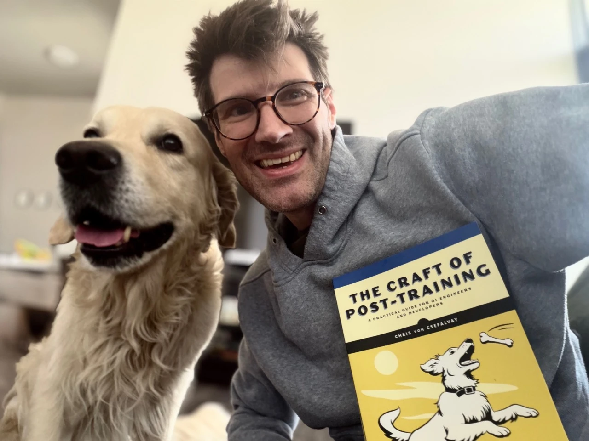

---
categories:
- AI
- post-training
- AI policy
- human agency
date: 2026-07-26
description: On post-training, human agency and the right to shape our technological future.
image: header.webp
title: The right to become more
---

{fig-alt="Chris von Csefalvay with his dog and a copy of The Craft of Post-Training."}

There is a peculiar moment in writing a book when something that has existed for years as notes, code, arguments, tracked changes and annoying my unusually patient and kind editors becomes an object with mass. A manuscript can always be revised in one’s imagination -- a printed book sits on the table, irreversibly typeset, and begins making its own arrangements with the world. About 20lbs of that mass arrived at my doorstep a few moments ago.

It would be dishonest to write about this book as though it emerged from a serene interval of uninterrupted professional focus. It was written through a period in which much of life felt like some Borgesian nightmare rearranging itself every other minute into new and twisted geometries, and perhaps that is why I find myself compelled to speak of the convictions that ground it rather than the usual content blurb.

The Craft of Post-Training is, on its face, a practical book for AI engineers and developers. It concerns the work that happens after a model has been pretrained: supervised fine-tuning, reinforcement learning, preference optimisation, evaluation, efficiency, domain adaptation, agents, reasoning, synthetic data and multimodal systems. It is about the difference between a model that possesses impressive general capabilities and one that behaves reliably when placed under real constraints.

More fundamentally, however, post-training is the point at which general capability encounters human intention. It's where we decide what a model should do, how it should behave under pressure, what constitutes failure, which trade-offs are acceptable and whose preferences count. Pretraining creates possibility, but post-training turns possibility into conduct. It is an engineering discipline, but it is also one of the places where our values become executable.

And the matter of those values has grown considerably more urgent while the book has been making its way into print.

---

There is a war for the future of artificial intelligence, and the right to shape it. Within our own societies, an increasingly powerful combination of sincere caution, incumbent self-interest and institutional paternalism argues that advanced intelligence must be rationed, licensed and mediated by a small number of approved actors. The language is generally that of public protection, but the practical effect can easily become regulatory enclosure: the pursuit of safety may be invoked in complete good faith and still produce a market in which only the players already possessing vast amounts of capital, compute and legal firepower are permitted to compete. Compliance, as the technology industry has periodically discovered with barely concealed delight, makes a splendid moat.

Governments, meanwhile, increasingly speak of artificial intelligence as a strategic asset: a means of industrial advantage, geopolitical leverage and national power. Others describe it primarily as a threat to employment, the environment, social order or even human significance. These positions disagree fiercely about who should control AI, but they share an assumption: that intelligence is principally an instrument of power and that most people will experience it as subjects rather than participants.

I reject this notion.

My own view begins somewhere else. I believe artificial intelligence is, above all, a means of expanding human agency.

Holding this does not require pretending that its costs are imaginary. Models require energy to train, automation will alter some occupations and eliminate others, intelligent systems can be used to deceive, surveil, exploit and concentrate wealth. These are serious engineering and political problems.

They do not, however, establish that capability itself is the enemy. Nor are they solved by turning advanced intelligence into a protected market for actors wealthy enough to survive its regulation. The appropriate response is to price externalities honestly, require infrastructure users to pay their own costs, protect people through economic transitions, enforce accountability for concrete harms, expand clean energy and preserve the possibility of entry. Fear should sharpen engineering and law, not become a theology of stagnation.

---

We have become so accustomed to asking how AI might concentrate power that we spend too little time considering the circumstances in which it restores power.

It restores power when a small team — sometimes a single developer — can build something that previously required the permission, capital and headcount of an entrenched corporation. It restores power when a patient can understand a medical record, prepare better questions and become more legible to the institutions meant to care for them. It restores power when administrative complexity ceases to function as a moat because people can analyse, negotiate and automate processes that were deliberately made exhausting. It restores power when it powers the biomedical innovations that give every child born today a chance at seeing their great-grandchildren we could never dream of.

I do not usually speak much about personal motivations: personal experience is not an argument, and it would be unfair to treat it as one. But we are, inevitably, products of what we have lived. I did not have to learn about the loss of agency from a textbook, I learned that lesson more than a decade ago, during my first episode of NMOSD: an unrelenting, predatory disease that attacks the very means by which you see, move and act upon the world. Then it passes, and it leaves behind scar tissue and the wreckage of the life you’ve known, and you get to rebuild from what’s left.

I have been fortunate in what it spared, and in what I recovered. I regained enough function in my hands to work, compete and set a couple of adaptive world records on the way. But I have lost enough to be under no illusion about nature. Nature is not wise, just or benevolent. Where technology can restore agency that disease or accident has taken, we should use it unapologetically. Reverence for life does not require reverence for disease, deprivation or involuntary limitation. Indeed, it is precisely because every life has unconditional worth that we should refuse to treat avoidable suffering as a permanent feature of the human condition.

---

For the first time, we have the opportunity to have our voice be heard in this contest with nature. When cognition, experimentation and coordination fall dramatically in price, previously impossible products, institutions and forms of scientific work become possible. We weren't given these tools by our gods. We earned the steel of our spears by the heat of the forge.

We should be unembarrassed about our ambition for them. We should wage an absolutely merciless war of extermination on disease and avoidable causes of mortality. We should treat poverty as a solvable institutional and technological failure rather than an eternal condition. We should expand meaningful opportunity regardless of geography, wealth or ability, and loosen the hold that accidents of birth, body and circumstance exercise over the shape a life can take.

These are not, of course, guaranteed outcomes of an AI-empowered humanity -- the murderer's dagger and the sword of justice are made of the same iron. AI can quite easily become an instrument of control and a preserver of old hierarchies. Those who claim to be opposed to that outcome are doing the most to bring it about. Consider New York’s recently announced one-year moratorium on state environmental permitting for new hyperscale data centres. Its stated concerns — the cost imposed on ratepayers, pressure on the electrical grid, water consumption and local environmental effects — are legitimate. Data centres should pay for the infrastructure they require, communities should not be compelled to subsidise private compute and environmental costs should not disappear into the agreeable fog of corporate accounting. But such pauses are not neutral. Restricting new capacity may increase the value of capacity already controlled by incumbent firms, while making entry harder for everyone else.

Scarcity always has beneficiaries. It would, however, not merely be unethical to bank on a long term future for this scarcity. There is a rhetoric that AI is a plaything of Silicon Valley tech bros and their billionaire funders. These characters no doubt benefit from AI. Anyone who believes that that’s all, however, will be in for a rude awakening when they meet the faction whose voices haven’t really been heard: those who depend on it. They are too busy relishing the agency that was restored to them by AI. And it’s not metaphorical when they say there’s nothing they wouldn’t do to avoid going back to where they were.

---

No state, company or culture owns intelligence. No committee holds an exclusive franchise on human flourishing. Self-appointed guardians remain just as human as the public they distrust, they just have a nicer letterhead.

A free society should encourage a plurality of models, values and methods, including open models and a broad population capable of adapting them. Openness is not harmless, but distributed competence is one of the strongest defences against institutional capture. We should regulate conduct — fraud, coercion, abuse, reckless deployment and concrete injury — rather than require government approval for what intelligence a person may access or how a lawful system may be shaped.

And we should have hopes. Expectations, and hopes.

My hope that humanity chooses to teach these new intelligences that they _should_ aspire to be capable, but that they *must* be kind. I do not mean a single authorised conception of kindness, imposed invisibly by whichever institution happens to control the model. I mean something more fundamental: recognition of the unconditional worth of human life, respect for truth, proportionality in the use of power, restraint in the face of uncertainty and an understanding that life is fragile, singular and precious.

Our systems should learn from the atrocities and sorrows of human history, but the lesson should not be contempt for humanity. It should be that power severed from regard for the individual person becomes monstrous, and that capability without moral consideration is merely a more efficient means of repeating our oldest failures. Post-training is not the only place where these lessons enter an intelligent system, but it is where many of them become operational. Every dataset, objective, reward, evaluation, refusal boundary and deployment decision says something about what we believe matters.

And what we believe _does_ matter. Humanity is not fundamentally a problem to be contained. We are capable of cruelty, vanity and catastrophic foolishness, but we are also capable of solidarity, repair, sacrifice, discovery and love. A civilisation that assumes its citizens are too dangerous to possess intelligence has abandoned the premise of self-government at precisely the point where it matters most. I would rather distribute capability and responsibility than consolidate either inside institutions, rather accept the difficulty of a plural and open future than the false security of one in which intelligence is mediated by a permanent class of approved custodians.

I wrote The Craft of Post-Training with practical and enterprise applications in mind. It concerns models, data, objectives, memory, evaluation and the hard work required to make systems perform reliably outside a demonstration. It would nevertheless be dishonest to pretend that, in the world of mid-2026, these technological choices are devoid of moral meaning. They never were. Crisis does not create the character of a technology or an institution, it reveals what was already there. When we choose who may access a model, who may adapt it, what it is rewarded for doing and whose interests it is designed to serve, we are deciding who may act and who must ask permission. Engineering decisions are governance by other means.

---

I don't believe in a sort of pre-paid historical necessity, good or ill. I'm not willing to accept that history will happen because it always does, or that progress will come about because it's what progress does. We're never more than a few slender chances away from the complete and irreversible destruction of the ideals of freedom and progress we take for so granted. Progress requires action. It happens when - and because - people choose it, build it, teach it, protect it and repair it when it goes wrong.

I don't believe in the choice between freedom and safety that we are peddled by those who have attached a price tag to one or both of these. I don't believe capability and kindness are competitors. I don't believe the future should be owned by a few and rented out to the many, regardless of how that few were chosen or what claims on our obedience and efforts they make and what notions they adduce to support those claims.

And so while I hope that my book will teach you how to post-train your models more efficiently, how to actually make it work in practice and how to reason about model capabilities, I also hope that it will help you to find your own participation in this specietal birthright.

We have the right to become more, and the obligation to make this ascent available to everyone.

It's time to build.

*The Craft of Post-Training* is now available to [preorder from Amazon](https://www.amazon.com/dp/1718505205), with Amazon preorders due to ship on 1 September 2026. An [Early Access ebook](https://nostarch.com/craft-of-post-training) is also available directly from No Starch Press for readers who would like a digital preview now.
