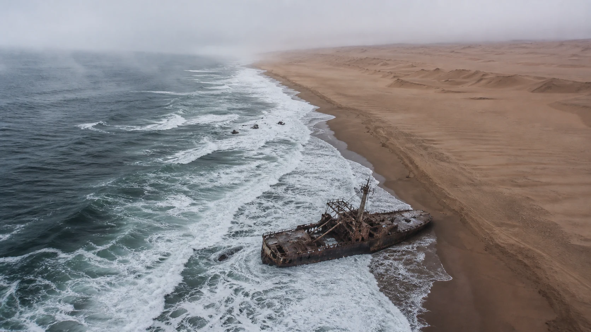

{fig-alt="A rusted shipwreck lies in foaming Atlantic surf where the ocean meets the dunes of Namibia's Skeleton Coast."}

Egocentric video for robot training now exists at a scale that is genuinely hard to hold in your head, and I have spent this week thinking about everything that is not in it.

Two things prompted that. [Mattie Fairchild](https://x.com/Scav/status/2083670860012069022) asked, more or less, what your actual differentiator is in a market where everybody is selling the same commodity. And we are releasing CERES tomorrow, which is our answer to a closely related question, so I have been obliged to work out what I actually think.



What I think is this: the differentiator is not volume but knowing which part of the map is empty, why it is empty and what it would be worth to fill it. Almost nobody selling training data today can answer any of those three questions. This is a massive problem and, for anyone paying attention, an equally massive opportunity.

So I'd like to start by telling you about the land God made in anger.

## The land God made in anger

A long time ago, I had some time to myself and ended up visiting the northern stretch of Namibia's shore. To this day, the Skeleton Coast, as it is rather poetically called, remains the strangest landscape I have ever been to.

The Namib, the oldest desert on earth, simply runs out of dunes and falls into the South Atlantic. The Benguela Current comes up cold from the south and clashes with the very much not cold sand of the Namib, and you get a coastline mostly shrouded in fog all morning. The San of the interior, who knew hardship when they saw it and were not sentimental about landscape, called it _the place God made in anger_. The name on the map today comes from John Henry Marsh, who in 1944 published his account of the wreck of the *MV Dunedin Star* under the title *Skeleton Coast*. The bones on the beach are whale and seal, left over from the whaling years, mingling with hulls, some of them now sitting hundreds of metres inland, because the dunes moved on and left them behind.

What stays with you, though, is the topology.

In a single field of view you have more water than you could use in a hundred lifetimes and not one drop of it is any good to you. Sailors who made it ashore alive did not drown but died of thirst, in sight of the Atlantic. Tantalus, standing chin-deep in a pool that withdrew whenever he bent to drink, would've recognised the arrangement immediately.

Anyway, that's your microcosm of egocentric data.

## The ocean and the desert

First, the ocean: it is real and it is getting bigger at a rate that is genuinely difficult to hold in your head. Ego4D anchored the field with several thousand hours. EPIC-KITCHENS gave us a hundred hours in forty-five kitchens, narrated by the participants themselves. EgoDex added 829 hours with per-frame 3D hand poses. EgoVerse, a collaboration across Georgia Tech, Stanford, UCSD, ETH, MIT, Meta and others, released 1,362 hours across 1,965 tasks and 2,087 demonstrators. And then Build AI went from ten thousand hours in November to a hundred thousand in December to something like a million by April. Five months. It is, to the best of my knowledge, the fastest dataset scaling anyone has ever done.

Nobody in this field is short of footage. Scaling works, the curves are real and I am not about to argue with them. What I'll argue with is the salinity.

Look at the ocean of data and like the sailors of the _Dunedin Star_, have a drink. Show me a task going wrong and then being recovered, rather than the clean take that got kept. Show me somebody doing a job they have done ten thousand times, in the room where they actually do it: a cardiac cath lab, a watch repairman's bench, a lambing shed, a luthier's workshop. Show me a two-person handover. Show me someone unloading a washing machine from a wheelchair.^[This is going to be easier now that we actually have this dataset.] Show me the same task in bad light, in a confined space, with the object half-occluded by the thing next to it. Show me anything performed with a constrained end effector, gloved or one-handed or through a tool. Show me an object that is not a mug.

The answer, near enough, is nothing. A million hours on one side, a desert on the other, and the tide line running right between them.

## Why the desert is there

It would be comfortable to conclude that the empty regions are empty because they are hard to reach. Mostly, though, they are not. They are empty because three filters sit between the world and the corpus, none having anything to do with what a policy needs to learn.

The first is recruitment. You collect from whomever will wear a rig for the going rate, which selects for availability rather than expertise, and it selects hard.

The second is staging. You collect what fits on a table, in a room you can book, under lights you control, in a session that ends on time. Anything outdoors, wet, nocturnal, cramped, expensive to set up or awkward to reset falls out of the frame before anybody makes a decision about it.

The third is the sneaky one, and it is adjudication. You collect what you can score. A dish that ends up in the rack has a legible success criterion, so it survives; a task whose success is a matter of judgement, or whose failure is partial, or only meaningful across a 20-minute horizon with interruptions in it, quietly does not get commissioned. Which means the evaluation apparatus is authoring the data distribution, upstream and invisibly. We built the benchmarks first and then, without ever deciding to, went and collected the world the benchmarks could see. We benchmaxxed our reality into oblivion.

Put the three together and the shape of the corpus becomes explicable. It is not a sample of how tasks are performed but a reflection of what tasks are easy to film. And because the collection process is now industrialised, we are producing that particular bias faster, more cheaply and more consistently than anyone has ever produced a bias before.

The diversity numbers do not save you here, incidentally, because the diversity is superficial. Two thousand demonstrators across two hundred scenes sounds like broad coverage right up to the point where you notice that all two thousand were recruited through the same filter, staged under the same constraints and scored against the same criteria. You have varied the surface and held the structure constant. That is the opposite of what you wanted.

## Three answers to Mattie's question

So, back to Mattie's question. Here are three answers, in ascending order of how uncomfortable they are.

### One: almost nobody can tell you what the data is for

Sampling without a stated objective is not data collection. It is accumulation. If you cannot articulate the downstream training objective, you cannot define a sampling frame, and if you cannot define a sampling frame then whatever bias your collection process happens to have is now permanently baked into somebody's policy. This is not an advanced insight. It is week one of any decent experimental design course.

The tell is the unit of account: everyone quotes hours, but hours is a measure of cost, not information. Statisticians settled this in 1936 (and the industry has been relearning it ever since) when the *Literary Digest* mailed out something like ten million ballots, got back two and a half million responses -- the largest sample anybody ever assembled to date -- and confidently predicted a Landon presidency. Gallup, working with a far smaller sample and a sampling frame he had actually thought about, called it for Roosevelt. Size did not save the *Digest*: its frame was drawn from telephone directories and car registrations in the middle of the Depression, so what it measured, with enormous statistical power, was the opinion of people who owned cars. The *Digest*'s approach was so misguided, putting an afterburner behind a rudder set the wrong way merely got it to crash faster.

The EgoVerse authors say much the same thing rather more politely, and they have the experiments to back it: policy performance improves with more human data, but effective scaling depends on the alignment between the human data and the robot learning objective. That sentence is the whole argument: alignment is a property of the sampling frame, not of the pile.

Underneath all this sits a literacy problem the industry is not discussing honestly. A great many data vendors have never trained a policy, have no working model of what an action space is, could not tell you whether their capture preserves the quantities a learning algorithm actually consumes and have never had to explain why a beautifully shot successful demonstration with no visible failure and no recovery is of limited use. A dataset is an answer to a question. If you cannot state the question, you have not built a dataset, you have built a pile.

### Two: access is not craft

The second differentiator is capture discipline, and this is the one where I have skin in the game, because it's why we built [CERES](https://ceres.wtf).

For $250, a length of duck tape and some spare time, you can strap a GoPro to a helmet, roam around for six hours and come home with something that certainly looks like training data. It has frames in it. It is large. You can put it in a bucket. It is extraordinarily easy to convince yourself you have done science, in the way that pointing a telescope at the sky feels like astronomy. Something is definitely being recorded, but the thing that makes science science was never the instrument. It was, and always will be, the protocol.

So ask what a psychophysicist would want to know before believing a single frame of your capture. Was there a protocol, written down before collection began? Was the instruction script delivered verbatim, or did the operator paraphrase and thereby quietly change the task? Were conditions counterbalanced? Were the inclusion and exclusion criteria fixed before anyone looked at the data, so that dropping a session is a decision rather than a temptation? Is there a calibration record? Is there an honest log of everything that went wrong, which is usually the most valuable file in the entire capture?

None of this is exotic. Experimental psychology has been doing it since Wundt opened the Leipzig laboratory in 1879, and it spent the 2010s learning, expensively and in public, what happens when you stop. It is a solved problem, in another building, down a different corridor, and the robot data industry has simply not walked over there yet.

> CERES is our attempt to walk over there and bring some of it back. It turns a Quest headset and a browser into a directed capture appliance with two roles rather than one. A capture director defines the protocol, watches quality live and reviews takes while they are still fresh; the demonstrator gets task-by-task cues in the headset. Tasks carry explicit cues, repetition counts, reset windows and cycles, so a run is a designed schedule rather than a vibe. Video, audio, head pose and hand joints share a single recorder clock. Missing observations are recorded as missing rather than quietly interpolated away, which matters far more than it sounds like it does. The director can watch hand velocity, surface normals and centre-of-mass traces while the take is running, so a bad take gets caught at the point where it can still be redone rather than three weeks later. If the director drops off the network the headset keeps recording locally, because protocols that assume perfect infrastructure are protocols for conference demonstrations rather than for fieldwork. What comes out the other end is a LeRobot v3 dataset. There is a solo mode, for those of us who capture alone in the kitchen with a golden retriever supervising.
>
> I want to be honest about the scope of this. CERES will not fix the industry. It was never going to. What it does is remove the excuse: if you want to capture properly, the tooling now exists, it is free and it runs in a browser.

### Three: you are not paying for hours, you are paying for surprise (or you should be, anyway)

Scaling curves describe the average behaviour of undifferentiated hours, and averages are exactly the wrong instrument for the situation we are in. We have watched, repeatedly, a few hours of precisely the right data move a model that ten thousand more hours of the same thing had left sitting exactly where it was -- not because small data is magic, but because the small set contained the specific thing that was missing. The second thousand hours of somebody loading a dishwasher carries almost no information the first thousand did not. One hour of the same task performed under a constraint the corpus has never seen carries a great deal. Information theory has been telling us this since 1948, and we keep buying by the litre anyway.

## Two claims, one bearing

I have kept something out of the argument so far, deliberately, and I would now like to put it back.

Everything above is a prudential case. The corpus is a map of collection convenience and we are mistaking it for a map of the world; that is bad engineering and it will cost money. I made it that way because the other case, the one I actually feel, is easy to discount as sentiment dressed up as analysis, and I did not want to hand anyone that exit.

Here is the other case. I have seen tens of thousands of hours of egocentric video of tasks I do very differently, because I work somewhat differently. Among others, since a slight disagreement between my immune system and my spinal cord, I don't have much useful wrist or finger flexion, so I grab things differently. The word for that is tenodesis, which is a neat little biomechanics trick: you drop your fingers around an object, then extend (flick upwards) your wrist. This causes the tendons to run out of slack and create a mechanically stable grasp around the object. I'm also in a slightly different position (seated) with different motion constraints (exclusivity of forward locomotion and manipulation). People like me are probably going to be the greatest beneficiaries of domestic assistive robotics, yet we're nowhere in the training set.

The part I keep turning over is that nobody decided this: there was no meeting at which the field considered atypical bodies and declined. The three filters simply did their work: we were not in the recruitment pool, our kitchens do not stage well (mine _a fortiori_ so), and our technique scores badly against rubrics written for a body that is not ours. An absence produced by procedure rather than intent is worse than a hostile decision, because there is no argument to win and nobody to have it with. We are building the demonstration set out of the users who need the product least and calling the result scale.

What is, however, most marvellous is that this blindness isn't just moral and doesn't just hurt people of different abilities. It is, actually, remarkably counterproductive -- so much so that this alone should make you think about the selection logic inherent in how data makes itself into our data supply chains.

Look at the geometry. A standing adult's egocentric camera sits somewhere around 1.6 to 1.8 metres. Mine sits at about 1.2m. Look at where the head camera sits on essentially any mobile manipulator you can buy today, and you will find it between roughly one metre and one and a half. We have spent real ingenuity on viewpoint augmentation and retargeting to close a gap that a seated demonstrator does not have in the first place.

Look at the hand. A tenodesis grasp has one (technically 0.5) degree of freedom, no independent digit control and no in-hand manipulation worth the name. Mechanically, that is a parallel jaw gripper with a person attached. Meanwhile, most of the corpus is five-fingered hands performing manoeuvres a gripper cannot copy, which means a great deal of it is teaching a policy techniques it will never be able to execute. Anyone who has manipulated under a hard effector constraint for years, whether through injury or gloves or tools or tongs, has developed an entire repertoire of compensation: pre-positioning objects against a fixture before closing on them, recruiting gravity and friction rather than force closure, bracing bimanually, choosing approach vectors that make the grasp geometrically possible at all. These all are worked solutions to problems robot learning is currently deriving from first principles -- badly.

Or consider, if you will, base placement. From a chair, you cannot take half a step. You solve a reach by deciding where the base goes first, approaching from the side that works, bracing against the table edge, sequencing so you never have to reposition halfway through. That is loco-manipulation, planned explicitly, several seconds ahead. Able-bodied demonstrators solve the same problem by shuffling their feet without noticing they did it, which is unfortunately the one solution the robot cannot copy.

The moral pull and the engineering pull point at the same coordinates.

## We needed a DeGolyer; instead, we got Dad Joiners.

Columbus Marion Joiner was seventy years old, quoted Shakespeare, and drilled the Daisy Bradford No. 3 in October 1930 on the strength of a prospectus written by his partner Doc Lloyd, a self-taught geologist and former medicine show operator, declaring the site the apex of the apex, a situation not found anywhere else. Nearly every claim in that document was wrong. One was not: there was oil under it, more oil than under anywhere else in the lower forty-eight.

Joiner had by then sold interests in the well amounting to, uh, _rather more than a hundred percent_ of it. He spent the aftermath of the largest discovery in American oil in a Dallas courtroom with his holdings in receivership, and sold out to H. L. Hunt for about $1.3 million, which was more money than he had ever seen and a rounding error against what the field went on to produce. Everyone else drilled at once. Crude went from $1.10 a barrel in 1930 to ten cents in 1931, and in some accounts a nickel. In August 1931, the governor sent the National Guard into the field, because an entire industry had proved unable to stop itself destroying the price of its own product.

If that reminds you of the data market, you're not alone, and Mattie's comments may prove prescient: a geologically illiterate prospectus over a real find, the same interest sold several times over, a price collapse driven not by any failure of demand but by undisciplined abundance. If your product is hours, your product is heading for ten cents a barrel, and it may already be there.

But then that's not fair on wildcatters, for there also was the other kind. Everette Lee DeGolyer located Potrero del Llano No. 4 in the Mexican Golden Lane while still an undergraduate, which is about as pure a wildcatting result as exists, and then spent the rest of his career turning exploration from intuition into measurement. He put the torsion balance and then the reflection seismograph to work finding structures underground, built the firm that industrialised applied geophysics, and ended up as senior partner of the house whose signature certified whether a company's stated reserves were actually there. Somebody had to be the person who said how much oil is really down the hole. He took the job.

The data industry has no DeGolyer, and the reason is not mysterious. The role consists almost entirely of evals, acceptance rubrics, provenance chains, dataset cards, published drop rates and the willingness to tell a paying customer their corpus is mostly seawater. Nobody gets a term sheet for that. We have no shortage of Joiners. Some of them have found something real, which is precisely what makes the next part avoidable rather than inevitable.

## Where to drill

So, wildcatters. The point of wildcatting was always to drill where the established operators were not sure there was anything. Do that. Specifically:

- **Failure and recovery.** Almost nobody records it, because it looks like bad data and it scores badly. It is the most valuable thing on this list.
- **Atypical bodies and atypical technique.** Seated reach envelopes. Constrained grasps.^[We're already on it, but we could always use more.] One-handed methods. Tremor. Closer to the target morphology than the mainstream corpus is, and almost entirely absent from it.
- **Expert hands in expert rooms.** Wet labs, clean rooms, BSL-4 suites (in full Racal suits, obviously!), dairy parlours, field agronomy, the workshop of the world's last insert-profession-here. Anywhere a task is performed by somebody who took years to learn it, in the place they actually perform it.
- **Improvisation and workaround.** Achieving a goal by a route the object was not designed for. Precisely the capability generalist policies lack, and one currently discarded as noise.
- **Degraded and awkward conditions.** Bad light, confined spaces, occlusion, clutter, wet, cold, outdoors, at night. Everything that falls out of the frame because it is inconvenient to stage.
- **The long tail of objects**, rather than the twelfth variant of a mug.
- **Long horizons and interruption.** Tasks that take twenty minutes, get put down halfway through and resumed. Nobody commissions them because nobody can score them.

Point a wildcatter at a proven field and you get a commodity supplier with a two-year horizon. Point one at unproven ground and you may well get the reason this field has a next decade. Their public function, whether or not any of them would put it that way, is to stop us training the same model on the same hours until the whole enterprise quietly runs out of new information.

---

There's a beetle in the Namib, _Onymacris unguicularis_. In the morning, it climbs onto a dune ridge, stands on its head into the wind and lets condensation run down its back into its mouth. This is called fog-basking, and it has been observed up in the northern Skeleton Coast dunes. A few metres up, the *Welwitschia* is doing the same trick with two leaves and no rain to speak of, and it lives for a thousand years. Neither of them drinks the ocean, neither of them could. The ocean was never the resource, the fog is.

Every ship lost on that coast was lost to the fog. Everything that lives there lives on it. The same fog -- all the difference lies in what you're prepared to do with it.

---

CERES is live now at [ceres.wtf](https://ceres.wtf), with a formal release going up on GitHub tomorrow. It's free, it's open, and it's meant to be used, broken and argued with. I would very much rather hear that it is wrong than that it is fine.
